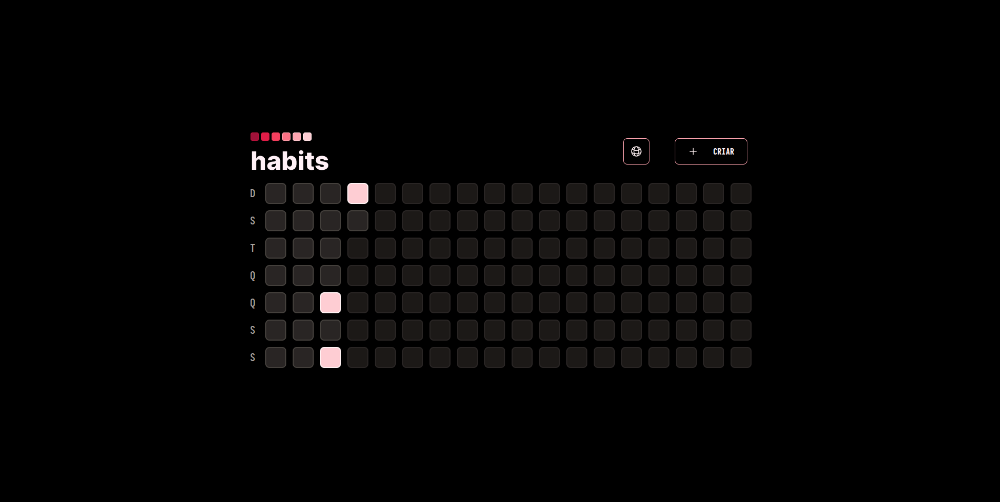
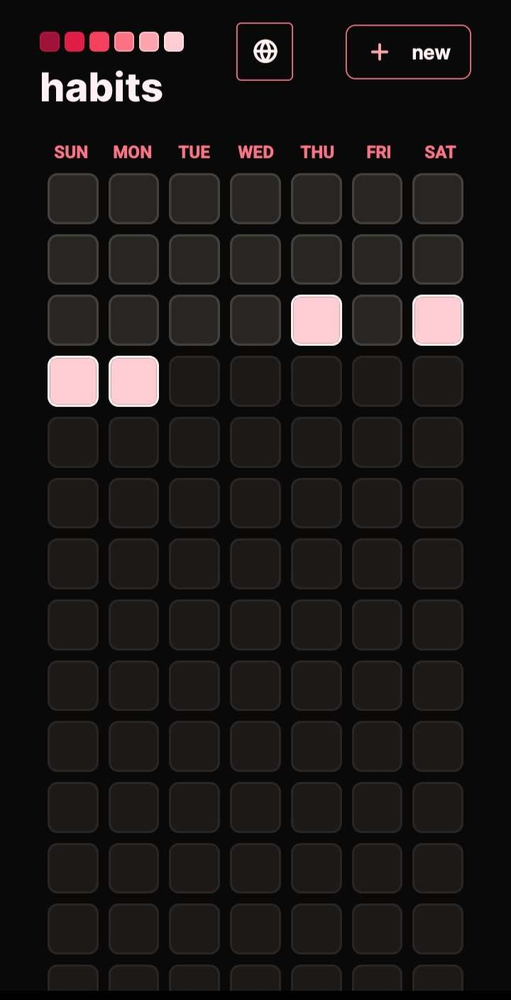
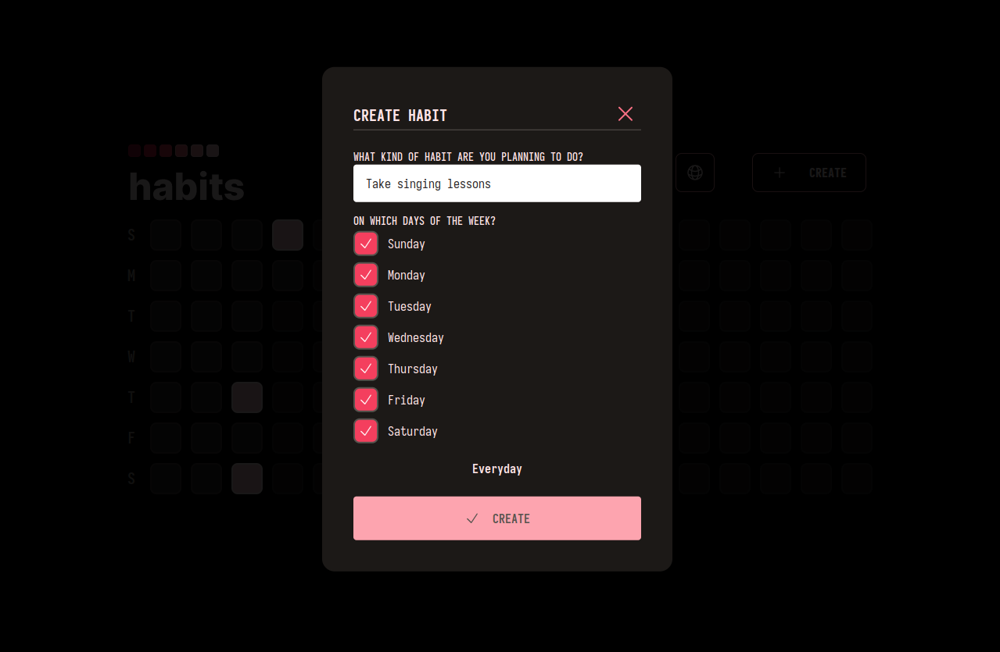
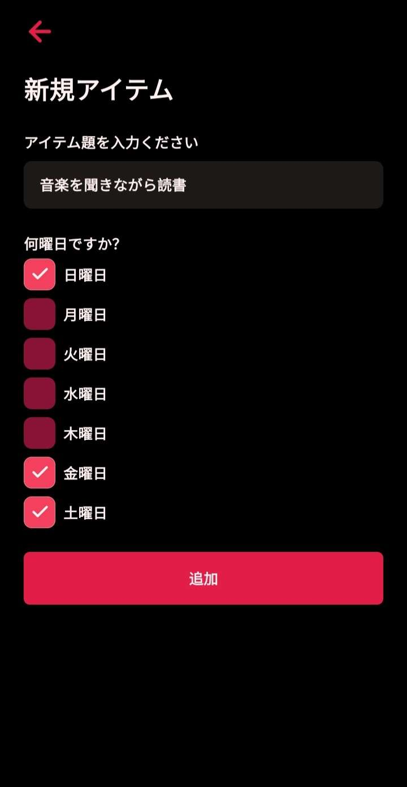

### Habit Tracker
*Um tracker de hábitos, desenvolvido na trilha Ignite durante a Next Level Week Setup (Jan/2023).*

#### Tecnologias utilizadas
* **Backend**: NestJS, Fastify, Prisma e SQLite.
* **Web**: ReactJS e TailwindCSS.
* **Mobile**: React Native e Expo.
* **Geral**: Typescript e NodeJS.

#### Diferenças do projeto original
* Paleta de cores vermelho-rosa em ambos web e mobile.
* NestJS em cima do Fastify no backend.
* Interfaces web e mobile disponíveis em Português, Inglês e Japonês.
* *O layout do web e mobile são essenciamente o mesmo, só com diferenças na estilização.*

****
 

